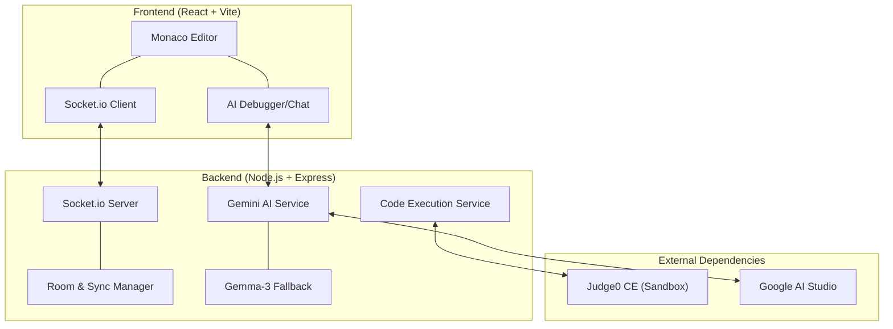

# 🚀 CoLab: Real-Time Collaborative Coding Workspace

<div align="center">
  
  
  <p align="center">
    <strong>A premium, real-time collaborative development environment designed for modern teams.</strong>
  </p>

  [](#)
  [](#)
  [](#)
</div>

---

## 🌟 Overview

**CoLab** provides a seamless, "Google Docs-style" coding experience with integrated multi-language execution. Built with the **Monaco Editor** (the engine behind VS Code), it offers professional-grade features in a collaborative environment.

> [!IMPORTANT]
> CoLab is currently in **Beta**. Powered by **Judge0 CE** for execution and **Google Gemini/Gemma** for AI intelligence.

---

## ✨ Key Features

### 💻 Professional Grade Editing
- **Monaco Editor Engine**: Built-in syntax highlighting, IntelliSense-like autocomplete, and code formatting.
- **Multi-Language Support**: Execute code in 10+ languages (Python, Java, C++, Go, Rust, etc.) instantly.
- **Dual Visual Themes**: 
  - **Sleek Modern**: Elegant plum & deep indigo for focus.
  - **Energetic Tech**: Cyberpunk neon for high-intensity work.

### 🤝 Real-Time Collaboration
- **Instant Sync**: Sub-millisecond code synchronization via WebSockets.
- **User Presence**: See who's in the room and what they're working on.
- **Zero Configuration**: Create a room, share the ID, and start coding.

### 🤖 AI-Powered Intelligence
- **Smart Generation**: Describe what you want, and CoLab builds the code for you.
- **Live Analysis**: Real-time bug detection and performance suggestions.
- **Debug Assistant**: Instant root-cause analysis for runtime errors.

<div align="center">
  
</div>

---

## 🏗️ Architectural Level Design

CoLab utilizes a robust, distributed architecture to ensure low latency and high reliability.



---

## 🛠️ Tech Stack

| Layer | Technology |
| :--- | :--- |
| **Frontend** | React, Vite, Monaco Editor, Tailwind CSS |
| **Backend** | Node.js, Express, Socket.io |
| **AI Intelligence** | Google Gemini 2.0 Flash / Gemma 3 |
| **Sandboxing** | Judge0 CE (Cloud Execution) |
| **Real-time** | WebSocket (Engine.io) |

---

## 🚦 Quick Start

### Prerequisites
- Node.js (v18+)
- npm / yarn

### Installation

1. **Clone and Setup**
   ```bash
   git clone https://github.com/your-username/colab.git
   cd colab
   ```

2. **Backend Config**
   Create `backend/.env`:
   ```env
   PORT=3000
   GEMINI_API_KEY=your_google_ai_studio_key
   ```

3. **Launch** (In separate terminals)
   ```bash
   # Terminal 1: Backend
   cd backend && npm start

   # Terminal 2: Frontend
   cd frontend && npm run dev
   ```

---

## 🛡️ Roadmap

- [ ] Persistent User Profiles & Cloud Storage
- [ ] Integrated Voice/Video Chat for collaborators
- [ ] Git Integration (Clone/Push directly from browser)
- [ ] Customizable Sandbox Resource Limits

---

Built with ❤️ by the Shivashish.
